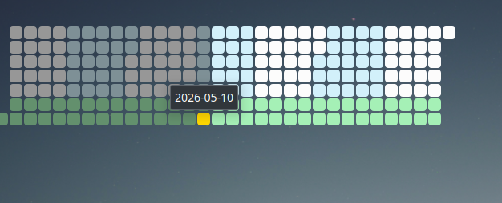

# Daytiles

A KDE Plasma 5 desktop widget that renders a [daytiles](https://github.com/Chamartin3/daytiles) calendar — a compact grid where every day is a tile you can color, highlight, and click. Useful for tracking events, habits, deadlines, or any per-day signal at a glance.

Targets **Plasma 5.27** on **Qt 5.15**.



## Features

- Month, week, weekday, and custom range layouts.
- Per-event types with custom colors; events stored in the widget config.
- Quick-add panel for new events; click a tile to see that day's events.
- Configurable tile size, gap, fade, weekend highlights, heatmap range, and a tooltip date format.
- Highlight rules form for arbitrary day-of-week or date-pattern coloring.
- Compact representation for panel mode.

## Install

```sh
kpackagetool5 -t Plasma/Applet --install package/
```

To upgrade an already-installed copy:

```sh
kpackagetool5 -t Plasma/Applet --upgrade package/
```

Or use the Makefile:

```sh
make install      # install
make upgrade      # install or upgrade
make run          # upgrade + open in plasmoidviewer
make package      # build a .plasmoid bundle
make uninstall    # remove
```

## Repo layout

- `package/` — the plasmoid (`metadata.json`, `contents/ui`, `contents/config`).
- `vendor/daytiles/` — pinned build of the upstream library.
- `assets/screenshots/` — screenshots used by this README.
